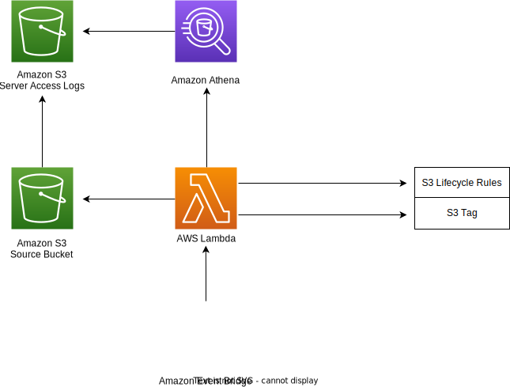

# Develeap Bucket Optimizer
## Intro

If you wanted to optimize the storage costs in your S3 bucket by using AWS S3 Intelligent-Tiering, but you encountered an obstacle related to the size of your objects, which need to be at least 128KB in size, don't worry, because you have come to the right place

Bucket Optimizer was created with the idea of reducing cases related to the inability to optimize the storage costs of objects due to their inappropriate size. The mechanism involves moving an object from S3 Standard to S3 Standard-IA class if certain conditions are met. In our case, these conditions will include an arbitrary number of days during which the object should not be modified, and a second declarative number indicating the number of days for which the object has not been accessed.

## Architecture

This project was created as a solution for this type of problem. The original proposal was slightly different in terms of the components in the flow, which can be found here:

https://aws.amazon.com/blogs/architecture/expiring-amazon-s3-objects-based-on-last-accessed-date-to-decrease-costs/

**The current architecture is represented in the diagram below:**




**The entire architecture consists of:**

- **Amazon S3 Source Bucket** (Our target bucket where the changes will be introduced)
- **Amazon S3 Server Access Logs** (A bucket for storing server access logs)
- **Amazon Athena** (An Amazon Athena query is run against the Amazon S3 Server Access Logs to verify whether the condition with the accessed time was met)
- **AWS Lambda** (A Lambda function executes a Python script to tag appropriate objects. Tagging objects triggers S3 Lifecycle Rules)
- **Amazon EventBridge** (An Amazon EventBridge rule is configured to periodically invoke the Lambda function)

## Structure of the repository
```
├── data.tf
├── images
│   └── newdiagram.drawio.svg
├── main.tf
├── modules
│   ├── optimize
│   │   ├── athena.tf
│   │   ├── cloudwatch_event.tf
│   │   ├── lambda.tf
│   │   ├── local.tf
│   │   ├── outputs.tf
│   │   └── variables.tf
│   └── origin_resources
│       ├── lifecycle.tf
│       ├── server_log_bucket.tf
│       └── variables.tf
├── providers.tf
├── README.md
├── scripts
│   └── optimizer_lambda.py
└── variables.tf
```
Our repository is organized into logically divided modules, named **optimize** and **origin_resources**. In the **origin_resources** module, we provision Amazon S3 Server Access Logs with S3 Lifecycle Rules based on the Amazon S3 Source Bucket. In the **optimize** module, we create all the resources actively used in the optimization process, including Amazon CloudWatch Events, AWS Lambda, and Amazon Athena. The **scripts** folder contains the backbone of our implementation, which is a Python script.

## Prerequisites before running:
 1. S3 terraform statefile backend - we are storing the project's terraform state in an s3 bucket, as a best practice. We assume that the bucket name will be 'bucket-optimizer-tf-backend'. But you can modify it manually.
 2. Source bucket - the bucket we want to optimize. Without the source bucket this project isn't relevant.
 3. Configure variables required variables
 4. Allow S3 log delivery group on the source ACL - currently it's impossible doing so using terraform as only the bucket owner has the permission to enable s3 server access logs. Therefore, we need to configure it manually BEFORE running this terraform project. Please follow AWS documentation: https://docs.aws.amazon.com/AmazonS3/latest/userguide/enable-server-access-logging.html
